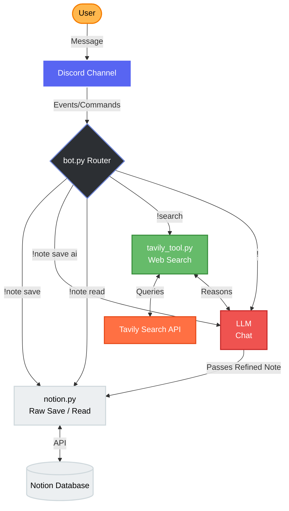

# Discord-Notion-Sync

An intelligent Discord bot that serves as a bridge between your chat and your Notion workspace.

> "You don't always need a complex UI to build a powerful AI agent. By combining Discord for the interface, LangChain for the logic, and Tavily for web search, you can turn a boring bot into a natural language assistant that provides real-time chat and saves your notes to Notion."

## 🚀 Features

- **AI-Powered Note Saving**: Save raw text or use AI to refine and summarize notes directly into Notion.
- **Web Search Agent**: Integrated Tavily-powered search agent to answer complex queries with live web data.
- **Notion Integration**: Read and write notes to your Notion database seamlessly.
- **LLM Support**: Powered by Groq (Qwen) for fast, high-quality reasoning.

## 🏗️ Architecture & Workflow



## 📁 Project Structure

```text
├── bot.py           # Main Discord bot and command routing
├── notion.py        # Notion API integration (save/read notes)
├── tavily_tool.py   # LangChain agent powered by Tavily for web search
├── pyproject.toml   # Project dependencies and configurations
└── .env             # API keys and tokens (Discord, Notion, Groq, Tavily)
```


## 📋 Prerequisites

Before you begin, ensure you have:
- [uv](https://github.com/astral-sh/uv) installed on your system.
- A **Discord Developer Application** with a generated Bot Token.
- A **Notion Integration** token and a target Page/Database ID.
- API keys from **Groq** and **Tavily**.

## 🛠️ Setup

1. Copy `.env.example` to `.env` and fill in your credentials:
   - `DISCORD_TOKEN`
   - `NOTION_TOKEN`
   - `NOTION_PAGE_ID`
   - `GROQ_API_KEY`
   - `TAVILY_API_KEY`
2. Install dependencies:
   ```bash
   uv sync
   ```
3. Run the bot:
   ```bash
   uv run bot.py
   ```

## ⌨️ Commands

- `!note save <text>`: Save a raw note to Notion.
- `!note save ai <text>`: Refine text with AI and save it.
- `!note read`: Fetch recent notes from Notion.
- `!search <query>`: Ask the web agent to research something.
- `!<anything else>`: Acts as a general chat with the LLM (e.g., `!hello`).
